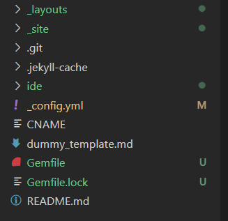
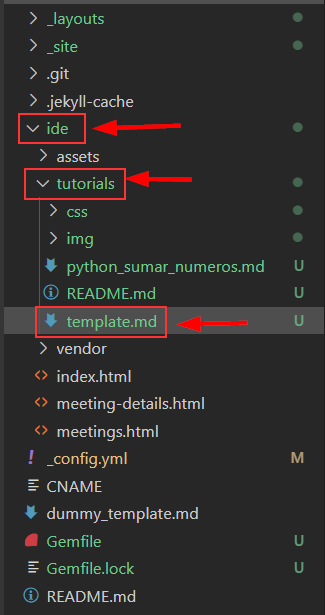

# Tutorial: Modifying the Markdown File
This tutorial will guide you step-by-step on how to modify and customize the Markdown file in this folder.

### Instructions for Modifying the File
1. **Clone the repository**  
   First, you need to clone the repository. Once cloned, you should see something like this:
   

2. **Create a copy of the template**  
   First, go to this path **ide / tutorials / template.md**  
   

  
   Then copy the **template.md** file into the same folder (tutorials) to modify it, and name it as you like.

3. **Front Matter**  
   Update the values within the `---` lines.
   - `layout`: Indicates the layout to be used. It should match the layout file you want to use.
   - `title`: Change the title to one that clearly describes the content of the tutorial.

4. **Tutorial Title**  
   Modify `# Tutorial Title` to reflect the main topic.

5. **Image**  
   - The line `
 The output will be:`) to be accurate.

8. **Conclusion**  
   - Summarize the key points of the tutorial here.

9. **References**  
   - List any sources that are useful for further exploration of the topic.

---

This README should provide a clear guide for modifying the Markdown file and customizing the content in each section.
