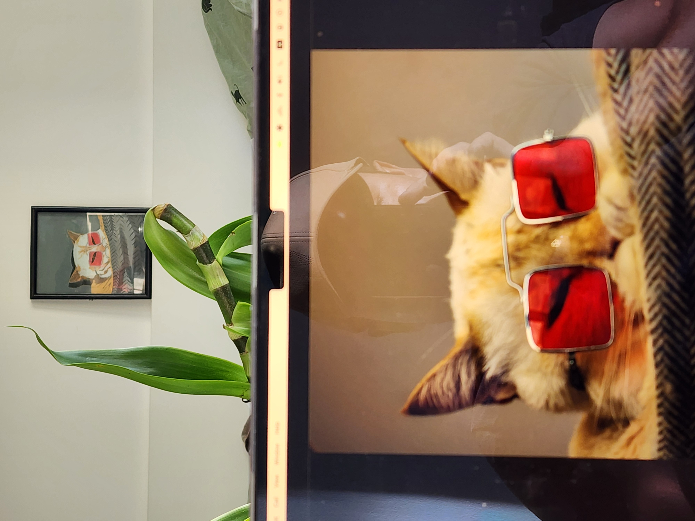

# Test Tutorial

<!-- You can replace the image and adjust the size as needed -->
<center></center>

## Table of Contents
<!-- Update the links to match the sections you actually use -->
* [Introduction](#introduction)
* [Examples](#examples)
    * [Example 1: Description of Example 1](#example-1-example-title-1)
    * [Example 2: Description of Example 2](#example-2-example-title-2)
    * [Example 3: Description of Example 3](#example-3-example-title-3)
* [Conclusion](#conclusion)
* [References](#references)

## Introduction
<!-- Write an introduction here that describes the purpose of the tutorial and what the user will learn -->
This test tutorial is to test the functionality of the markdown parser.

## Examples
<!-- Make sure each example is well-explained and relevant to the tutorial topic -->
#### Example 1: Example Title 1

```python
print("Hello, world 1!")
```
> The output will be: 
```
Hello, world 1!
```

#### Example 2: Example Title 2

```python
print("Hello, world 2!")
```
> The output will be: 
```
Hello, world 2!
```

#### Example 3: Example Title 3

```python
print("Hello, world 3!")
```
> The output will be: 
```
Hello, world 3!
```

## Conclusion

<!-- Provide a clear and concise summary of what the user should have learned in this tutorial -->
Write a conclusion here, summarizing the key points of the tutorial.

## References
<!-- List any sources you used or that the user can refer to for more information -->
* Reference 1
* Reference 2
* Reference 3
